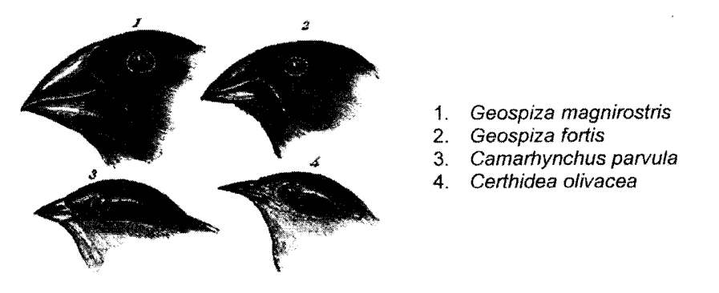
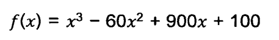
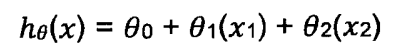

**<ins>July 2023, 2 hours, by Leith</ins>**

QUESTION 1<br>
a) <br>
A computer scientist wishes to use artificial neural network (ANN) to automatically determine
the species of Galapagos finches (birds of the subfamily Geospizinae) in images using the
following measurements: Beak length, beak height, eye diameter, head length and body
length.

Given the location where the pictures were taken, the possible species are  
1. Large Ground Finch Geospiza magnirostris  
2. Medium Ground Finch Geospiza fortis,   
3. Small Tree Finch Camarhynchus parvulus   
4. Green Warber-Finch Certhidea olivacea.  

He has a database of 500 labelled images of these species to train his ANN.



Provide your input on the following design aspect of this ANN. That is, give choices for
these design aspects and justify your choices.

a) <br>
How many input units should the ANN have? [4 marks]

b) <br>
How many output units should the ANN have? [4 marks]

c) <br>
Should the ANN use hidden units or not? [4 marks]

d) <br>
Should the ANN use feedforward connection, recurrent connection, both or neither? [4 marks]

e) <br>
What activation functions should the neuron use? [4 marks]

f) <br>
What learning mechanisms should the ANN use? [5 marks]


QUESTION 2<br>
Assume we have a function to optimize:
<br>
where x is constrained to 0 to 31. We wish to maximize f(x) (the optimal is x =
10). Using a binary representation, we can represent x using five binary digits as
in the chromosomes table below:

| Chromosome    | Binary String |
|---------------|---------------|
| P<sub>1</sub> | 11100         |
| P<sub>2</sub> | 01110         |
| P<sub>3</sub> | 10111         |
| P<sub>4</sub> | 00100         |

a) <br>
If P2 and P3 are chosen as parents and we apply one point crossover, show the resulting
children, C1 and C2. Use a crossover mask 11000. Do the same usingP1 and P4 with a
crossover point of 2 and create C3 and C4. Provide you answer in a table format as the
following example: [8 marks]

| Chromosome    | Binary String |
|---------------|---------------|
| C<sub>1</sub> |               |
| C<sub>2</sub> |               |
| C<sub>3</sub> |               |
| C<sub>4</sub> |               |

b) <br>
Calculate the value of x and f(x) for C1, C2, C3, C4. Provide you answer in a table format
as the following example: [8 marks]<br>

| Chromosome    | Binary String | x | f(x) |
|---------------|-------------|---|------|
| C<sub>1</sub> |             |   |      |
| C<sub>2</sub> |             |   |      |
| C<sub>3</sub> |             |   |      |
| C<sub>4</sub> |             |   |      |


QUESTION 3 <br>
Suppose you are building an SVM model on data X. The data X can be error-prone which
means that you should not trust any specific data point too much. Now think that you want to
build an SVM model which has a quadratic kernel function of polynomial degree 2 that uses
Slack variable C as one of its hyperparameters.

a) <br>
What would happen when you use a very large value of C(C>infinity) and what happen
when the C is very small (C~0)? Explain your answer. [6 marks]

b) <br>
Explain the impact that occurs if we change these hyperparameters in SVM,namely the
regularization and tolerance parameters. [3 marks]


QUESTION 4<br>
In labwork 1, you have developed a regression model to predict the housing price based on
few features given such as the size of the house, no of bedrooms, furnishing status, etc.

a) <br>
Based on the task, build a flowchart for the developed prediction model. State the
function of each block in the flowchart. [10 marks]


b) <br>
Suppose you have m=4 houses, and each house has area and number of bedrooms
which can be used to predict the house price. A dataset of the features is as follows:

| Price  | No of bedrooms | Sqft_Area |
|--------|----------------|-----------|
| 490000 | 1              | 880       |
| 630000 | 3              | 1930      |
| 640000 | 4              | 1940      |
| 570000 | 3              | 1350      |

You'd like to use polynomial regression to predict a house price from its numbersof
bedrooms and sqft_area. Concretely, suppose you wish to fit a model ofthe form:



where x, is the number of bedrooms and x₂ is sqft_area. Further you plan to use both
feature scaling (dividing by the max-min, or range, of a feature) and mean normalization.
What is the normalized feature x24 (i.e. for the fourth training data)? [10 marks]

c)<br>
What is the difference between local minima and global minima gradient descent? [5 marks]


QUESTION 5 <br>
Answer the following questions:<br>
a)<br>
The Naïve Bayes classifier is a supervised machine learning algorithm, which is used for
classification tasks. It is estimated that 50% of emails are spam emails. Some software
has been applied to filter these spam emails before they reach your inbox. A certain
brand of software claims that it can detect 99% of spam emails, and the probability for
a false positive (a non-spam email detected as spam) is 5%. Now if an email is
detected as spam, then what is the probability that it is in fact a non-spam email? [10 marks]

b)<br>
Principal component analysis (PCA) is a statistical method for identifying patterns in
data. It can also be used to compress data via dimensionality reduction. Specify and
explain the steps needed to perform PCA on a set of data provided in Table 1. [10 marks]<br>

| x   | y    |
|-----|------|
| 2.5 | 2.4  |
| 0.5 | 0.7  |
| 2.2 | 2.9  |
| 1.9 | 2.2  |
| 3.1 | 33.0 |
| 2.3 | 2.7  |
| 2.1 | 6    |
| 1.1 | 1    |
| 1.5 | 1.6  |
| 1.1 | 0.9  |


c)<br>
What is the function of the following Python coding in PCA? [5 marks]<br>
```python
import numpy as np
x = np.array([2.5, 0.5, 2.2, 1.9, 3.1, 2.3, 2.1, 1.1, 1.1, 1.5])
y = np.array([2.4, 0.7, 2.9, 2.2, 3.0, 2.7, 6.0, 1.0, 1.6, 0.9])

x_standardized = (x - np.mean(x)) / np.std(x)
y_standardized = (y - np.mean(y)) / np.std(y)
```
