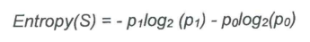
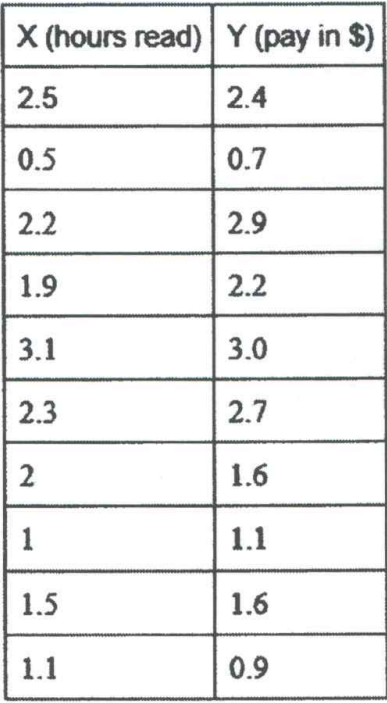
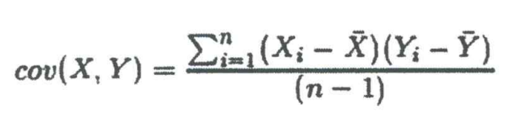
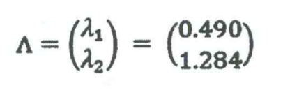
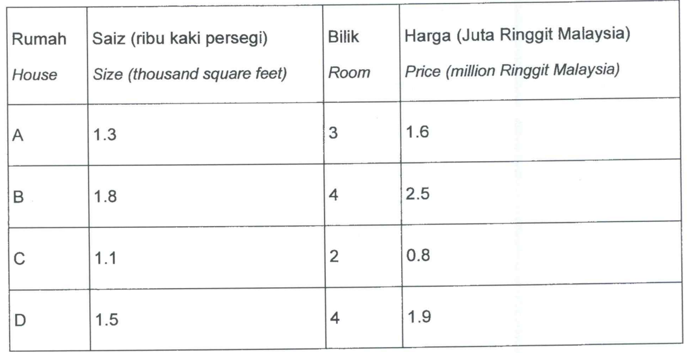

QUESTION 1 
a) 
Overfitting is very common in Machine Learning. Decision Tree is also possible to be overfitted.
Overfitting occurs when a model learns the training data too well, capturing noise or random
fluctuations in the data rather than the underlying pattern. In decision trees, overfitting can lead
to overly complex trees that perform well on the training data but generalize poorly to unseen data.
 

Give TWO (2) solutions or approaches that can be used to avoid or solve this overfitting problem
in the Decision Tree. [2 marks]

b)  
Entropy is a measure of disorder or uncertainty in a system. In information theory, it is often used
to quantify the amount of information contained in a message or a random variable. Let's consider
a simple biased coin flip. Suppose we have a coin that is biased, such that the probability of
landing heads is p =0.6 and the probability of landing tails is the opposite q.

i) Calculate the probability of landing tails q. [1 mark]

ii) Calculate the entropy (S), given the formula for entropy is: [4 marks] 

iii) Explain what it means by the value you calculated above. [1 mark] 

c)  
ID3 (Iterative Dichotomiser 3) is a popular algorithm used for building decision trees, which are a
type of predictive model used in machine learning. The algorithm was developed by Ross Quinlan
in 1979.  Describe TWO (2) important characteristics of ID3. [2 marks]

QUESTION 2 
Consider a Genetic Algorithm (GA) being used to solve a simple optimization problem of
maximizing a function, where x is a real number in the range [0, 6]. Assume a population size of
10, a crossover probability of 0.8, and a mutation probability of 0.1.

a) 
Describe the initialization process in the GA and explain how it generates the initial population. [2 marks]

b) 
What is the fitness function for this problem and explain how it evaluates the quality of solutions. [2 marks]

c) 
Describe the process of selection, crossover, and mutation using the example above. [3 marks]

d) 
State THREE (3) termination criteria that could be used to stop the GA. [3 marks]

QUESTION 3 
You are visiting town A in country Z. In this town, the parents in the community are encouraging
their children to read by paying them according to the hours they spend reading books. The
amount of pay varies depending on the parent. You've made some data collection by doing a
quick survey of 10 parents and how much they pay their children to read. The data is given below
in Table 1. In the dataset below, X (hours spent reading) is the feature vector and y (pay in $) are
the target output.

Table 1. The number of hours reading and its payment. 

a) 
Calculate the covariance Cov(X, Y). The formula for computing the covariance between variable
x and y is given as follows.

Where X₁ is the ith sample of feature X, X is the mean of feature X, n is the total number of
samples in the dataset. [5 marks]

b) 
What is the difference between correlation and covariance?Give an example using two variables
X and Y. Why are we calculating covariance instead of correlation for PCA? [3 marks]

c) 
The eigenvalues for this problem has been calculated and is given as  

Which eigenvalues are more important and why? [2 marks]

QUESTION 4 
John has the information of 4 houses, i.e. size in thousand square feet, number of rooms and
price in million Ringgit Malaysia, and presented in the table below:

John assumes that the houses can be grouped into 2 clusters, P and Q, using K-Means algorithm
with Euclidean distance. Apart from this, he also assumes the initial cluster centers are (1, 1, 1)
and (3, 3, 3) respectively.

a)  
What is the value of K for this case? [1 mark]

b)  
With the assumptions made by John, determine the houses that belong to both the clusters.
Present your answer in a table form. [3 marks]

c)  
Based on the assumption of John, where are the next cluster centers? [2 marks]

d)  
Instead of using K-Means clustering, Caine suggests using a bottom-up (agglomerative)
hierarchical clustering. To be more precise, Caine wants to perform a single-linkage clustering by considering Euclidean distance between objects.

Help Caine to find 2 clusters using the algorithm described above. [4 marks]

QUESTION 5 
Explain what is the Reinforcement Learning paradigm? Explain each of the key components of
reinforcement learning (RL) below. For each of the components give an example of the
components in the context of financial trading. [10 marks]

a) Agent

b) Environment

c) Action

d) States

e) Rewards

f) Policy